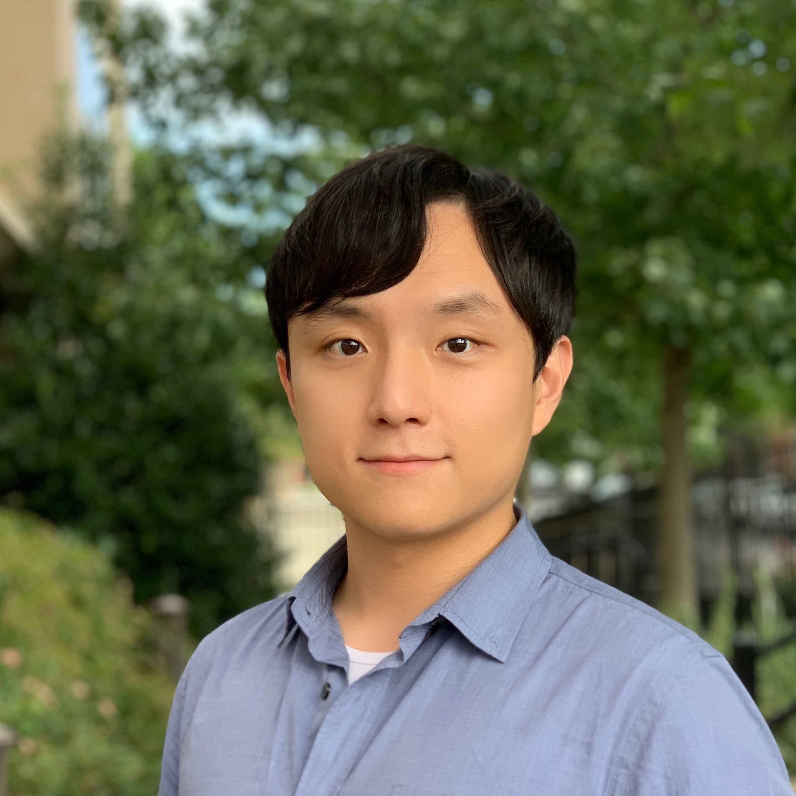

I am a PhD student in the Department of Epidemiology, Johns Hopkins Bloomberg School of Public Health. My research interests include environmental exposure mixtures (i.e. heavy metals, air pollutants), health impact of meteorological conditions, causal inference, and epidemiological methods.

I graduated from Yonsei University with BA and MA degree in Applied Statistics and from Johns Hopkins University with a MHS degree in Epidemiology.

My full CV is available [here](files/jihwan_park_cv_200831.pdf).